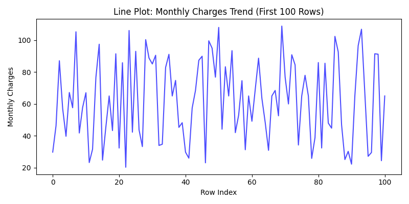
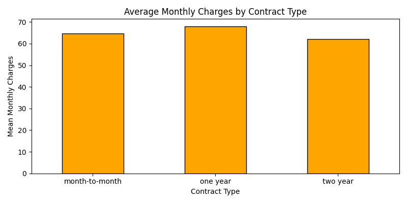
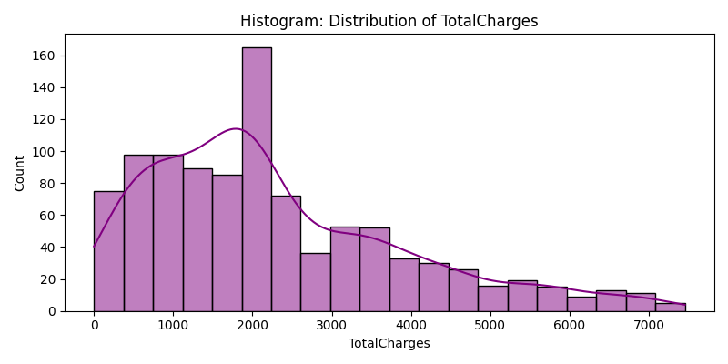
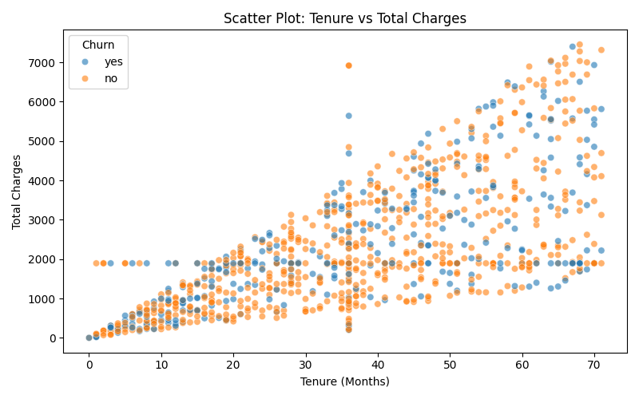
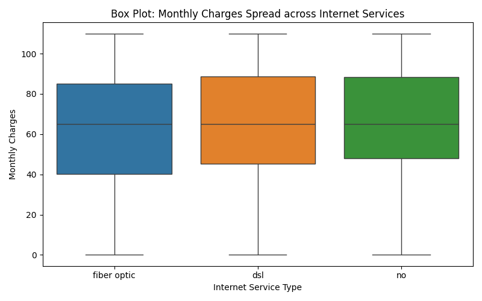
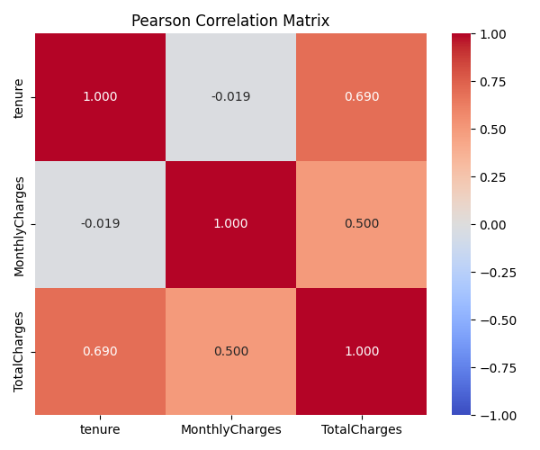

### Part 1 README 
### description
For this project i take "churnguard_data.csv" raw dataset. The dataset represents telecom customer demographics and account metrics used to predict whether a customer will cancel their service

Part 1 performs Exploratory Data Analysis (EDA) and data-quality preparation for the ChurnGuard telecom customer churn project. The raw churnguard_data.csv dataset contains customer demographics, service details, contract information, and billing features used in the later churn prediction pipeline.

this has totally 1030 rows and 12 columns

Initial Dataset Inspection
The script loads the raw CSV and displays:
First 5 rows
Data types
Dataset shape
Null-value counts and percentages

Null Value Analysis:
several missing values was performed across all 12 columns
InternetService: 16 Nulls 
tenure: 50 Nulls 
TotalCharges: 64 Nulls 
MonthlyCharges: 75 Nulls

Missing values are checked across all columns using both counts and percentages.

The script applies a 20% missing-value threshold. No column exceeds this threshold, so no column is dropped.

For the academic cleaned table, numerical missing values are filled using median imputation. The median is less affected by extreme values than the mean.

Duplicate Detection and Removal:
df.duplicated().sum() is used to identify duplicate records, and df.drop_duplicates() removes them from both the academic and modeling copies.
The raw dataset contains 30 duplicate rows, leaving 1000 records after duplicate removal.

Data Type Correction and Text Standardisation:
The script standardises object/category columns by:
Removing leading and trailing spaces
Converting text to lowercase
Collapsing repeated whitespace
Converting TotalCharges to numeric

Known category variations are also mapped into consistent values:
→ fiberoptic / fibre optic → fiber optic
→ 1 year → one year
→ 2 year → two year
→ month to month / month-to-m / monthly → month-to-month

**Academic Cleaning vs Production Modeling Data:**

Two datasets are created intentionally

cleaned_data.csv is the academic cleaned table. It contains the full-table median imputation and academic data-quality corrections.

modeling_data.csv preserves genuine missing values and invalid domain values as missing markers so that the later production pipeline can learn preprocessing statistics only from training data.

This separation prevents the academic full-table imputation from becoming production data leakage.

Outlier and Skewness Analysis

The script checks skewness for:
→ tenure
→ MonthlyCharges
→ TotalCharges

For the academic table, negative tenure values and MonthlyCharges values above 200 are replaced with the respective median. In the modeling table, these values are converted to missing values for leakage-safe preprocessing.

IQR Outlier Detection:
IQR is used to detect potential outliers in MonthlyCharges and TotalCharges.

The calculation uses:
IQR = Q3 - Q1

and the bounds:
Q1 - 1.5 × IQR and Q3 + 1.5 × IQR.

Visualizations:

The script generates the following EDA outputs:

line plot:

The line plot shows monthly charges across the first 100 rows.

bar plot:

The bar plot compares average monthly charges by contract type.

histogram:

The histogram displays the distribution of the most-skewed numeric feature.

scatter plot:

The scatter plot shows tenure versus total charges, coloured by churn.

box plot:

The box plot compares monthly-charge distributions across internet-service types.

Correlation Analysis:

A Pearson correlation matrix is calculated for the numeric features:
tenure, MonthlyCharges, and TotalCharges.

Output Files:
Running eda.py creates:

cleaned_data.csv — academic cleaned dataset
modeling_data.csv — leakage-safe modeling dataset
line_plot.png
bar_plot.png
histogram.png
scatter_plot.png
box_plot.png
correlation_heatmap.png

How to Run

Place churnguard_data.csv in the Part 1 working directory, then run:

python eda.py

Install the required dependencies if needed:

pip install pandas numpy matplotlib seaborn

