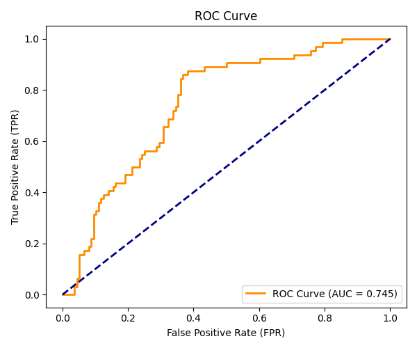

### part 2 README

Target Definition and Feature Preparation:

Part 2 uses the academic cleaned_data.csv produced by Part 1. The customerID column is removed because it is only an identifier and should not be used as a predictive feature.

Two target variables are created for two different ML tasks:
Regression target y_reg: MonthlyCharges, a continuous numeric value representing the customer's monthly charge.
Classification target y_clf: the Churn column converted from yes/no into 1/0.

The regression experiments use two feature sets. The academic version keeps TotalCharges, while the fair comparison removes TotalCharges because it is closely related to the target MonthlyCharges.

**Categorical Encoding:**
Text-based categorical features are converted into numerical features using pd.get_dummies(..., drop_first=True).

One-hot encoding (but optimized with Dummy encoding)  is used because categories such as payment method and internet service do not have a meaningful numerical order. Each category becomes an independent binary feature instead of creating an artificial ranking.

drop_first=True removes one dummy category from each categorical feature group. This reduces redundant information and helps avoid the dummy-variable trap in regression models.

Boolean dummy columns are converted to integer values (0/1) so the resulting feature matrix can be used consistently by the ML algorithms.

Train-Test Split and Feature Scaling:
The encoded data is divided into training and testing sets using an 80/20 split with random_state=42.

For classification, stratify=y_clf is used so that the class distribution is preserved between the training and test sets.

StandardScaler is fitted only on the training data and then used to transform both training and test data:
fit_transform(X_train) → learn training statistics and scale training data
transform(X_test) → apply the same training statistics to unseen test data
This prevents test-set statistics from influencing the training process.

Regression Models:
LinearRegression() is trained on the academic feature set containing TotalCharges. Performance is evaluated using:
Mean Squared Error (MSE)
R² score

Ridge Regression:
Ridge(alpha=1.0) adds L2 regularization to the regression model. The penalty discourages excessively large coefficients and can make the model less sensitive to noisy or highly related features.

Classification — Logistic Regression:
The classification model is Logistic Regression with:
max_iter=1000, class_weight="balanced", random_state=42
class_weight="balanced" gives additional weight to the minority churn class during training.

Confusion Matrix:
The confusion matrix separates predictions into:
→ True Positive (TP): churn customer correctly identified
→ False Positive (FP): retained customer incorrectly flagged as churn
→ False Negative (FN): churn customer missed by the model
→ True Negative (TN): retained customer correctly identified

Precision measures how many customers predicted as churn actually churned.
Recall measures how many of the actual churn customers were successfully detected.
F1-score combines precision and recall into a single harmonic-mean metric.

ROC Curve and AUC:

The model's predicted churn probabilities are used to create an ROC curve.

ROC-AUC summarizes the model's ability to distinguish churn customers from retained customers across thresholds. An AUC of 0.5 represents random discrimination, while higher values indicate better separation.

Decision-Threshold Sensitivity:

The default probability threshold is not treated as the only possible decision rule. The code evaluates:

0.30, 0.40, 0.50, 0.60, 0.70

For each threshold, probabilities are converted into predictions and Precision, Recall, and F1-score are calculated.

Lowering the threshold generally makes it easier for a customer to be classified as churn, which can increase recall while also increasing false positives. Raising the threshold generally makes the churn classification more difficult.

This is an academic threshold experiment; the final production threshold is selected separately in Part 3.

Logistic Regression Regularization Experiment:

A second Logistic Regression model is trained with C=0.01 while the baseline uses the default C=1.0.

In Logistic Regression, a smaller C means stronger regularization. Stronger L2 regularization constrains model coefficients and can reduce overfitting, although excessive regularization can also cause underfitting.

Output

Running train_model.py performs the academic regression and classification experiments and generates:

Regression MSE and R² results
Classification report
Confusion matrix
ROC-AUC result
roc_curve.png
Decision-threshold sensitivity results
Logistic Regression regularization comparison

How to Run:

Place cleaned_data.csv in the Part 2 working directory and run:

python train_model.py

Install the required dependencies if needed:
pip install pandas matplotlib scikit-learn
