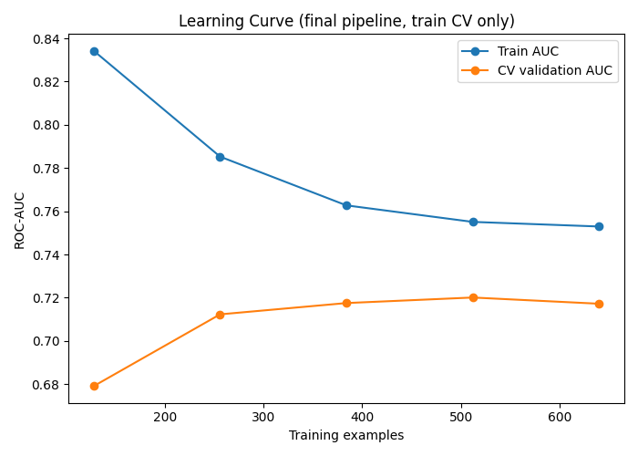

### part3 Readme
This part focuses on comparing multiple classification models and building the final leakage-safe churn prediction pipeline.

Input Data

File                            Used for
cleaned_data.csv               Academic experiments
modeling_data.csv              Final leakage-safe production pipeline

The academic experiments use the cleaned dataset, while the production pipeline preserves missing values so preprocessing can happen inside the pipeline.

Unconstrained Decision Tree:

The first experiment uses a Decision Tree without restricting max_depth.
DecisionTreeClassifier(max_depth=None, random_state=42)

Result:
Train Accuracy = 1.0000
Test Accuracy  = 0.6400

The tree fits the training data perfectly, while its test accuracy is much lower. This demonstrates the overfitting behavior of an unconstrained Decision Tree.

Controlled Decision Tree:

The next experiment limits the tree complexity:
max_depth = 5
min_samples_split = 20

Result:
Train Accuracy = 0.7338
Test Accuracy  = 0.6500

The training accuracy decreases, while the train/test gap becomes smaller than the unconstrained tree.

Gini vs Entropy:

Two controlled Decision Trees are compared using different splitting criteria.

Criterion             Train Accuracy           Test Accuracy
Gini                    0.7388                   0.6350
Entropy                 0.7325                   0.6500

This experiment shows how changing the tree's split criterion affects the resulting model performance.

Random Forest & Gradient Boosting:

Two ensemble models are tested using the academic train/test split.

Model               Train Accuracy         Test Accuracy        ROC-AUC
Random Forest         0.9500                 0.6800              0.7325
Gradient Boosting     0.8550                 0.6700              0.7237

These results are part of the academic experiments. They are not used alone to decide the final production model.

Academic 5-Fold Cross-Validation:

The academic experiments also compare four models using 5-Fold CV.

Model                          Mean CV ROC-AUC            Std Dev
Logistic Regression               0.7166                   0.0240
Controlled Decision Tree          0.6904                   0.0420
Random Forest                     0.6825                   0.0488
Gradient Boosting                 0.6813                   0.0350

The code keeps this experiment for academic comparison, but it is not used for final model selection because the scaler was fitted before cross-validation.

**Leakage-Safe Production Model Comparison:**
For the final model-selection process, modeling_data.csv is used.

Each candidate model is placed inside the shared production preprocessing pipeline. Preprocessing is therefore fitted separately inside each cross-validation fold.

The four candidates are:
1. Logistic Regression
2. Controlled Decision Tree
3. Random Forest
4. Gradient Boosting

The comparison uses the same 5-Fold Stratified CV and ROC-AUC scoring for every model.

Production CV Results:

Model                           Mean CV ROC-AUC               Std Dev
Logistic Regression              0.7161                        0.0251
Controlled Decision Tree         0.6946                        0.0494
Random Forest                    0.6810                        0.0476
Gradient Boosting                0.6805                        0.0344

The code selects the model with the highest mean CV ROC-AUC.

Selected Model → Logistic Regression

Hyperparameter Tuning:
After selecting Logistic Regression, GridSearchCV is used to search for better hyperparameters.

For Logistic Regression:
C:
0.01, 0.1, 1.0, 10.0

Solver:
liblinear, lbfgs

The production pipeline is tuned using the same 5-Fold CV and ROC-AUC scoring.

Best Parameters
C = 10.0
Solver = liblinear
Best CV ROC-AUC = 0.7172

Learning Curve:

A learning curve is created to observe how validation ROC-AUC changes as more training examples are used.

The validation AUC values are:

Training Examples               Validation AUC
     128                            0.6791
     256                            0.7123
     384                            0.7175
     512                            0.7201
     640                            0.7172

The learning curve uses only the training portion of the data with cross-validation.

Production Threshold Selection:
The model's probability output is converted into a churn prediction using a threshold.

Instead of selecting the threshold using the test set, the code generates out-of-fold probabilities from the training data.

Thresholds from:
0.30 → 0.70
are tested using F1-score.

Selected Threshold
Threshold = 0.45
OOF F1     = 0.5928

The threshold is frozen before the final test evaluation. 

Final Test Evaluation:

The final pipeline and frozen threshold are evaluated once on the untouched test set.

Metric                               Result
ROC_AUC                              0.7437
Precision                            0.5140
Recall                               0.8594
F1-Score                             0.6433

Confusion Matrix

[[84, 52],
 [ 9, 55]]

The test set is kept separate from model selection and threshold selection.

Save the Final Production Artifacts:

The final fitted pipeline is saved as:
best_model.pkl
This file contains the production preprocessing pipeline together with the selected Logistic Regression model.
The selected threshold and model information are saved as: 
decision_threshold.json
The JSON stores the threshold, selection metric, CV AUC, test ROC-AUC, model name, best parameters, and feature lists.

**Important for Part 4:**

The saved pipeline expects the raw feature columns as input.

Do not apply get_dummies() manually before sending data to the model. The production pipeline already contains the required preprocessing.
 
